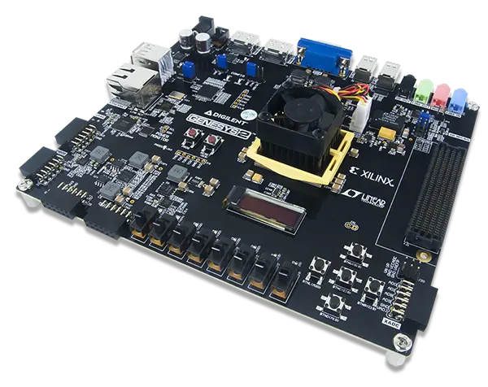

.. _cv32a6_genesys2:

Digilent GenesysII with CV32A6 SoC
##################################

Overview
********

The Digilent GenesysII board features a Xilinx Kintex-7 FPGA which can run various softcore CPUs.
In this configuration, the GenesysII is configured with a 32-bit version of the CVA6 RISC-V CPU.
The SoC is configured with a memory controller interfacing with the Genesys' DRAM, PLIC and CLINT
interrupt controllers, a UART device interfacing with the Genesys' USB UART, a RISC-V compatible
debug module that interfaces with the Genesys' FTDI (USB JTAG) chip, a Xilinx SPI interface
interfacing with the Genesys' SD card slot and a Xilinx GPIO interfacing with the Genesys' LEDs
and switches.
The complete hardware sources (see first reference) in conjunction with
instructions for compiling and loading the configuration onto the GenesysII are available.

   Digilent GenesysII (Credit: Digilent)

See the following references for more information:

- `CVA6 documentation`_
- `GenesysII Reference Manual`_
- `GenesysII Schematic`_

Hardware
********

- CVA6 CPU with RV32imac instruction sets with PLIC, CLINT interrupt controllers.
- 1 GB DDR3 DRAM
- 10/100/1000 Ethernet with copper interface, lowRISC Ethernet MAC
- ns16550a-compatible USB UART, 115200 baud
- RISCV debug module, connected via on-board FTDI (USB JTAG)
- Xilinx SPI controller, connected to microSD slot
- Xilinx GPIO, connected to 7 switches and LEDs

Supported Features
==================
+-----------+------------+-------------------------------------+
| Interface | Controller | Driver/Component                    |
+===========+============+=====================================+
| INTERRUPT | on-chip    | RISC-V PLIC, CLIC (CLINT in CVA6)   |
+-----------+------------+-------------------------------------+
| UART      | on-chip    | uart                                |
+-----------+------------+-------------------------------------+
| JTAG      | on-chip    | openocd runner for west             |
+-----------+------------+-------------------------------------+

Programming and Debugging
*************************

Loading the FPGA configuration
==============================

You need to build a bitstream with Xilinx Vivado and load it into the FPGA
before you can load zephyr onto the board.
Please refer to the CVA6 documentation for the required steps.
This configuration is compatible with the following build targets:
cv32a6_imac_sv0, cv32a6_imac_sv32, cv32a6_imafc_sv32, cv32a6_ima_sv32_fpga.

Flashing
========
west flash is supported via the openocd runner.

Debugging
=========
west debug, attach and debugserver commands are supported via the openocd runner.

References
**********

.. _CVA6 documentation:
   https://github.com/openhwgroup/cva6

.. _GenesysII Reference Manual:
   https://digilent.com/reference/programmable-logic/genesys-2/reference-manual

.. _GenesysII Schematic:
   https://digilent.com/reference/_media/reference/programmable-logic/genesys-2/genesys-2_sch.pdf
